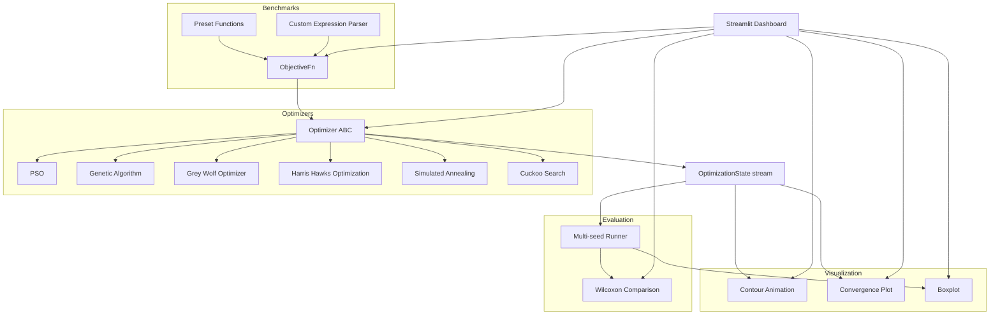

# Algorithm Arena

Metaheuristic optimization algorithms racing on benchmark functions, with live
visualization, user-defined objective functions, and statistical comparison.

## 🚀 Streamlit App

[Try it here](https://algorithm-arena-htquudbeabvpxlcvxyfzv5.streamlit.app/)


## Features

- 6 metaheuristic optimizers behind a shared `Optimizer` interface: Particle
  Swarm Optimization, Genetic Algorithm, Grey Wolf Optimizer, Harris Hawks
  Optimization, Simulated Annealing, Cuckoo Search
- 4 standard benchmark functions (Sphere, Rastrigin, Ackley, Rosenbrock)
- Live animated contour plots showing agent movement across iterations
- Convergence comparison charts across multiple algorithms
- Interactive Streamlit dashboard with Single Run, Race Mode, and Statistical
  Comparison tabs
- **User-defined objective functions** — write your own expression (e.g.
  `x**2 + y**2 + 10*sin(x)`) and race optimizers on it, parsed safely without
  `eval()`
- **Statistical rigor** — multi-seed runs, boxplot distributions, and paired
  Wilcoxon signed-rank tests to check whether one algorithm is *actually*
  better than another, not just luckier on one run
- CI pipeline (lint, format check, tests, Docker build) and one-command
  deployment to Streamlit Community Cloud

## Architecture



## Design Decisions

- **Generator-based optimizers (`yield` instead of `return`)**: allows the
  dashboard to render each iteration as it happens, without waiting for the
  full run to complete, and lets headless benchmarking consume only the
  final state.
- **Vectorized objective functions**: every benchmark function and the
  custom expression parser operate on the full agent population as one
  numpy array, not via per-agent Python loops — critical for contour grids
  with 10,000+ evaluation points.
- **Safe expression parsing without `eval()`**: user-defined functions are
  parsed with `sympy.parsing.sympy_parser.parse_expr`, restricted by a
  character whitelist, a locked-down `local_dict`, and an empty
  `__builtins__` — closing the code-execution vector that a naive
  `eval()`-based parser would expose. See `tests/test_custom_expression.py`
  for the injection attempts this was tested against.
- **Wilcoxon signed-rank test over t-test**: metaheuristic best-score
  distributions are typically non-normal (right-skewed), violating the
  t-test's core assumption — this is standard practice in the metaheuristics
  literature.
- **Paired seed sequences across algorithms**: comparing algorithm A and B
  using the same seed sequence (not independent random seeds) ensures
  observed differences come from the algorithm itself, not from lucky or
  unlucky initial populations.

## Statistical Comparison Methodology

Algorithms are compared using paired Wilcoxon signed-rank tests across N
independent runs, with the same seed sequence used for every algorithm
(ensuring paired, not independent, comparisons). Wilcoxon was chosen over a
t-test because best-score distributions from metaheuristics are typically
non-normal — this is standard practice in the metaheuristics literature. The
dashboard reports mean, standard deviation, a boxplot of the full
distribution, and pairwise p-values at a configurable significance level (α).

## Custom Expressions & Security Note

The dashboard lets you type your own 2D objective function instead of picking
a preset benchmark, e.g. `x**2 + y**2 + 10*sin(x)`.

**User input is never passed to Python's `eval()`.** Expressions are parsed
with `sympy.parsing.sympy_parser.parse_expr`, restricted to:

- A character whitelist (regex) that rejects underscores and anything
  outside basic math syntax — this alone blocks dunder-based patterns like
  `__import__`.
- A `local_dict` limited to `x`, `y`, and a fixed set of math functions
  (`sin`, `cos`, `exp`, `sqrt`, `log`, ...) — any other name fails to resolve.
- `global_dict={"__builtins__": {}}` — removes access to real Python builtins
  during the internal `eval` that `sympy` performs internally, closing the
  main code-execution vector.
- The `auto_number` transformation is disabled, since it conflicted with the
  builtins lockdown above; numeric literals are handled as plain Python
  numbers and wrapped into `sympy` types after parsing.

This was tested against injection attempts (e.g.
`__import__('os').system(...)`) during development — see
`tests/test_custom_expression.py`.

## Setup

```bash
uv sync
uv run pytest
```

## Run the Dashboard

```bash
uv run streamlit run src/algorithm_arena/app/dashboard.py
# or
uv run algorithm-arena
```

## Run with Docker

```bash
docker build -t algorithm-arena .
docker run -p 8501:8501 algorithm-arena
```

## Project Structure

```
algorithm-arena/
├── src/algorithm_arena/
│   ├── optimizers/       # Optimizer interface + PSO, GA, GWO, HHO, SA, Cuckoo Search
│   ├── benchmarks/       # Standard benchmark functions + safe custom expression parser
│   ├── evaluation/       # Multi-seed runner + Wilcoxon statistical comparison
│   ├── visualization/    # Plotly contour animations, convergence plots, boxplots
│   └── app/              # Streamlit dashboard (Single Run, Race Mode, Statistical Comparison)
├── tests/
├── docs/                 # Demo GIF, architecture notes
├── .github/workflows/    # CI: lint, format check, tests, Docker build
├── Dockerfile
├── pyproject.toml
└── README.md
```

## Roadmap

- [x] Phase 0 — Project scaffolding
- [x] Phase 1 — Optimizer interface, benchmarks, PSO, GA
- [x] Phase 2 — GWO, HHO, Simulated Annealing, Cuckoo Search
- [x] Phase 3 — Contour animation + convergence comparison plots
- [x] Phase 4 — Streamlit dashboard (Single Run + Race Mode)
- [x] Phase 5 — User-defined objective functions (safe sympy parsing)
- [x] Phase 6 — Statistical comparison (multi-seed runs, boxplots, Wilcoxon test)
- [x] Phase 7 — CI/CD, Docker, deployment
- [x] Phase 8 — Final polish and presentation

## License

MIT
